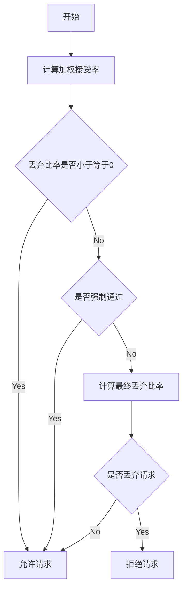
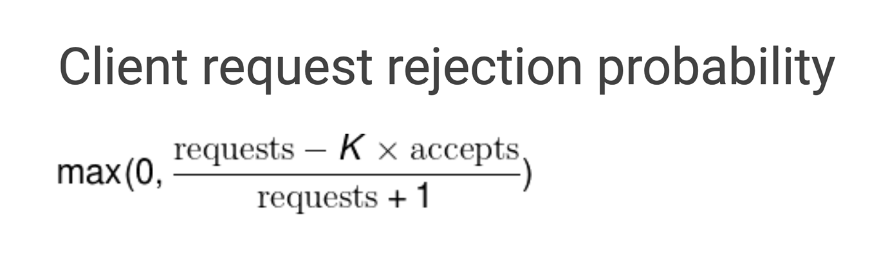

# 熔断器
断路器又叫熔断器，是一种保护机制，用于保护服务调用链路中的服务不被过多的请求压垮。当服务调用链路中的某个服务出现异常时，断路器会将该服务的调用请求拒绝，从而保护服务调用链路中的其他服务不被压垮。

比较知名的熔断器算法有 Hystrix 和 Sentinel，它们都是通过统计服务调用的成功率和响应时间来判断服务是否可用，从而实现熔断的功能。

go-zero 已经内置了熔断器组件 breaker.Breaker ，go-zero 中采用滑动窗口来进行数据采集，目前是以 10s 为一个窗口，单个窗口有40个桶，然后将窗口内采集的数据采用的是 google sre 算法计算是否开启熔断，详情可参考 https://landing.google.com/sre/sre-book/chapters/handling-overload/#eq2101。 
## code
breaker.go
## core
https://github.com/zeromicro/go-zero/blob/master/core/breaker/googlebreaker.go

Google Sre过载保护算法，该算法的原理如下：

请求数量(requests)：调用方发起请求的数量总和

请求接受数量(accepts)：被调用方正常处理的请求数量

在正常情况下，这两个值是相等的，随着被调用方服务出现异常开始拒绝请求，请求接受数量(accepts)的值开始逐渐小于请求数量(requests)，这个时候调用方可以继续发送请求，直到requests = K * accepts，一旦超过这个限制，熔断器就回打开，新的请求会在本地以一定的概率被抛弃直接返回错误，概率的计算公式如下：

通过修改算法中的K(倍值)，可以调节熔断器的敏感度，当降低该倍值会使自适应熔断算法更敏感，当增加该倍值会使得自适应熔断算法降低敏感度，举例来说，假设将调用方的请求上限从 requests = 2 * acceptst 调整为 requests = 1.1 * accepts 那么就意味着调用方每十个请求之中就有一个请求会触发熔断

## HTTP & gRPC 中使用
在 go-zero 中，开发者不需要对请求单独进行熔断处理，该功能已经集成到了框架中，因此开发者无需关心。

HTTP 以请求方法+路由作为统计维度，用 HTTP 状态码 500 作为错误采集指标进行统计，详情可参考 breakerhandler.go

gRPC 客户端以 rpc 方法名作为统计维度，用 grpc 的错误码为 codes.DeadlineExceeded, codes.Internal, codes.Unavailable, codes.DataLoss, codes.Unimplemented 作为错误采集指标进行统计，详情可参考 breakerinterceptor.go

gRPC 服务端以 rpc 方法名称作为统计维度，用 grpc 的错误作为错误采集指标进行统计，详情可参考 breakerinterceptor.go

## 参考
* https://talkgo.org/t/topic/1454
* https://talkgo.org/t/topic/3035
* https://segmentfault.com/a/1190000043836629
* https://mp.weixin.qq.com/s/r1kTYUK_r-JalvhzAKKQwg
* https://go-zero.dev/docs/tutorials/service/governance/breaker