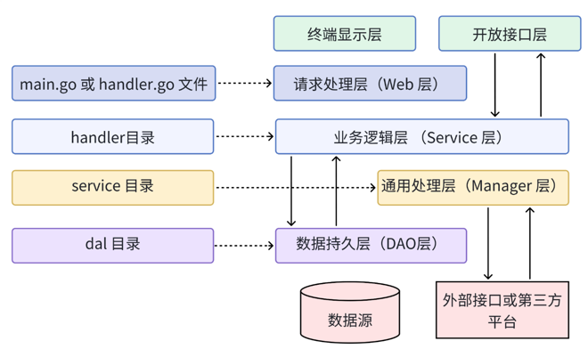
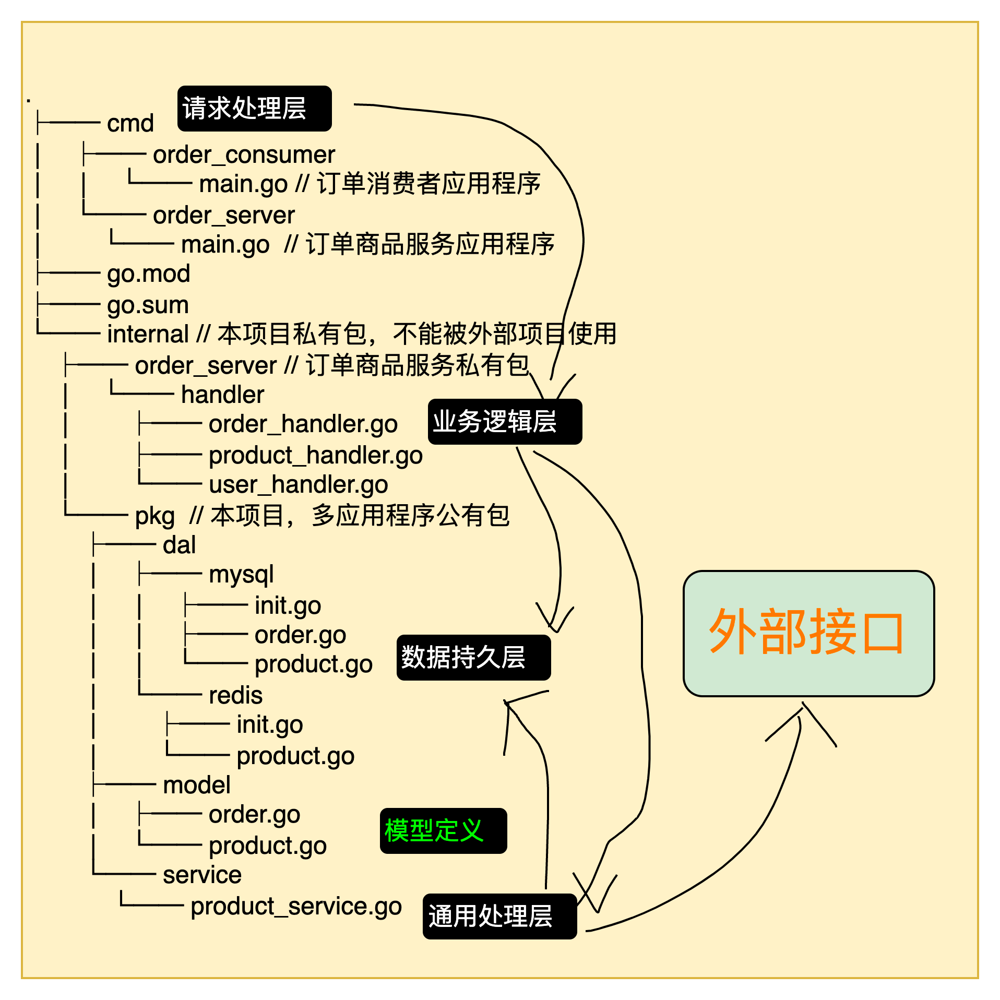

# project layout

* 请求处理层。接受请求参数校验
* 业务逻辑层。可以调用通用层和 DAO 层
* 通用处理层。封装通用逻辑（内外部）复用
* 数据持久层。

参考：
[https://github.com/golang-standards/project-layout](https://github.com/golang-standards/project-layout)

* 剪头为调用关系
* 模型定义除 “请求处理层”外，其余层均可能使用到