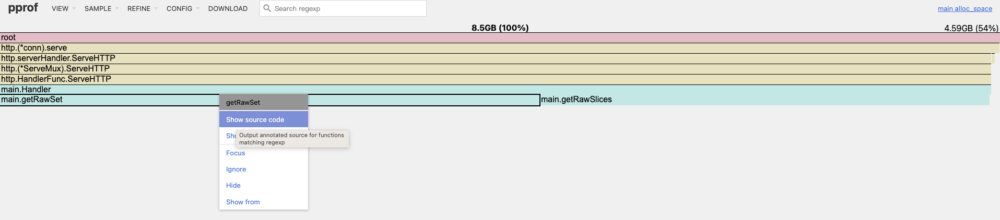

# skill

## 测试工具

```
go run main.go
-n 请求数量 
-c 并发数量
ab -n 30000 -c 2 http://127.0.0.1:8888/
```

```
curl "http://127.0.0.1:8888/debug/pprof/heap?seconds=30" > heap.pprof

go tool pprof -http :8889 heap.pprof
```

查看火焰图，确定代码块

## 优化一

```
getRawSet->getEmptyStructSet
```

```
go test -bench='.' -benchmem -benchtime=10
```

输出

```
goos: darwin
goarch: amd64
pkg: skill
cpu: Intel(R) Core(TM) i7-8569U CPU @ 2.80GHz
BenchmarkGetRawSet-8               14428            821715 ns/op          427606 B/op        319 allocs/op
BenchmarkGetEmptyStructSet-8       15247            806454 ns/op          389463 B/op        255 allocs/op
PASS
ok      skill   40.961s
```

427606 B/op->389463 B/op
map 的value 用空结构体 内存节约

## 优化二

slice  预设容量

```
BenchmarkGetRawSlices-8           154268             70002 ns/op          357628 B/op         19 allocs/op
BenchmarkGetCapacitySlices-8      653289             18920 ns/op           81920 B/op          1 allocs/op
```

357628 B/op->81920 B/op 内存节约
70002 ns/op->18920 ns/op cpu节约


## 优化三

map 预设容量

```
BenchmarkGetRawSet-8               14671            859794 ns/op          427590 B/op        319 allocs/op
BenchmarkGetEmptyStructSet-8       15139            782725 ns/op          389454 B/op        255 allocs/op
BenchmarkGetCapacitySet-8          29354            407447 ns/op          182481 B/op         11 allocs/op
```

内存，cpu 节约

## 优化四
使用 for 循环

因为 当使用 for range 值遍历的方式时，每次迭代都会将结构体元素复制到一个新的变量中。
如果结构体的字段较多或者字段的数据类型占用较大空间（如包含大型数组的结构体），这种复制操作的开销会很大。

go test -bench=. -benchmem range_test.go
```
BenchmarkSliceStructByFor-8               633325              1612 ns/op               0 B/op          0 allocs/op
BenchmarkSliceStructByRangeIndex-8        725910              1617 ns/op               0 B/op          0 allocs/op
BenchmarkSliceStructByRangeValue-8          3408            299235 ns/op               0 B/op          0 allocs/op
```
性能差距百倍
