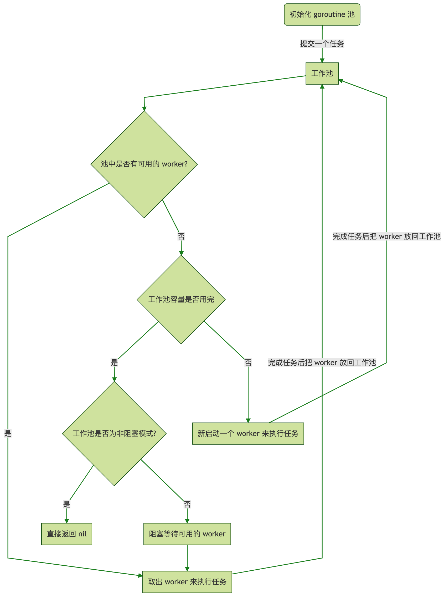

# 协程池
```
go test -benchmem  -bench=.
```

输出
```
goos: darwin
goarch: amd64
pkg: skill2/workerpool
cpu: Intel(R) Core(TM) i7-8569U CPU @ 2.80GHz
BenchmarkGoPool-8                    219           5421042 ns/op          180350 B/op      10598 allocs/op
BenchmarkGo-8                         39          31971605 ns/op          164369 B/op      10010 allocs/op
BenchmarkWorkerPool-8                156           7596215 ns/op          161016 B/op      10017 allocs/op
PASS
ok      skill2/workerpool       6.346s
```

## ants v1.x
design: https://strikefreedom.top/archives/high-performance-implementation-of-goroutine-pool#%E5%AE%9E%E7%8E%B0%E4%B8%80%E4%B8%AA-goroutine-pool


### pool.go
* Pool:
    * capacity
    * running
    * expiryDuration
    * workers
      * 可用 workers切片类型
      * 按时间从旧到新，从后往前 lifo
      * 方便删除过期 worker
    * lock
      * 同步 workers
    * cond 
      * 阻塞时被唤醒获取空闲 worker
        * 定期清理时所有阻塞任务会被唤醒
        * worker重置放回队列只会唤醒一个阻塞任务
    * periodicallyPurge()
      * 独立协程定期清理过期 task
        * Worker.task <- nil

### worker.go
* Worker
    * pool
      * 所属的 pool
	* task 
        * chan func()
    * recycleTime
        * 重新入队时间