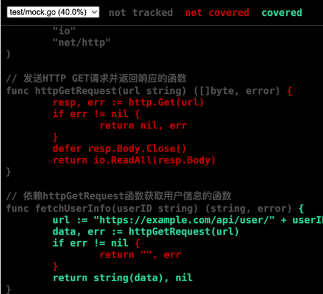

# test
## 单元测试
```go
//常用
func TestAdd(t *testing.T) {
	// Arrange(安排）
	a := 5
	b := 3
	expected := 8

	// Act（行动）
	result := Add(a, b)

	// Assert（断言）
	assert.Equal(t, expected, result)
}
//分组
func TestAddWithConvey(t *testing.T) {
	Convey("关于Add函数的测试", t, func() {
		Convey("正常情况的测试", func() {
			Convey("两个正数相加", func() {
				result := Add(2, 3)
				So(result, ShouldEqual, 5)
			})
			Convey("一个正数和一个负数相加", func() {
				result := Add(5, -3)
				So(result, ShouldEqual, 2)
			})
		})
		Convey("边界情况的测试", func() {
			Convey("两个零相加", func() {
				result := Add(0, 0)
				So(result, ShouldEqual, 0)
			})
			Convey("一个数与最大整数相加", func() {
				result := Add(int(math.MaxInt32), 1)
				So(result, ShouldEqual, int(math.MaxInt32)+1)
			})
		})
	})
}
```
## mock
```go

func TestMock(t *testing.T) {
	// 使用gomonkey mock函数httpGetRequest的返回
	mockData := []byte(`{"name":"killianxu","age":32}`)
	patch := gomonkey.ApplyFunc(httpGetRequest, func(url string) ([]byte, error) {
		return mockData, nil
	})
	defer patch.Reset()

	// 底层httpGetRequest的函数调用返回，会被mock
	mockUserInfo, _ := fetchUserInfo("123")

	fmt.Printf("mocked user info: %s\n", mockUserInfo)
}
```
其中

gomonkey.ApplyFunc(httpGetRequest, funcB)

替换httpGetRequest的函数调用，funcB就是替换后的函数，实现测试函数解耦，去除不稳定依赖

## 单侧覆盖率
go test -coverprofile=coverage.out

go tool cover -html=coverage.out -o coverage.html 生成 html 格式


total 行获取项目总测试覆盖率
```
go tool cover -func=coverage.out
test/main.go:3:         Add             100.0%
test/mock.go:9:         httpGetRequest  0.0%
test/mock.go:19:        fetchUserInfo   80.0%
total:                  (statements)    45.5%
```

### gitlab  流水线
.gitlab-ci.yml
```yaml
# 定义用于运行CI任务的Docker镜像，这里选择最新的Go语言镜像
# 该镜像将提供运行Go项目测试所需的环境
image: golang:latest  

# 定义CI/CD的阶段，这里只设置了一个test阶段用于执行单元测试
stages:  
  - test  

# test阶段的具体配置
test:  
  # 此阶段名称为test，用于执行单元测试任务
  stage: test  
  script:  
    # 更新项目的依赖项，确保所有依赖都是最新且正确的
    - go mod tidy  
    # 运行单元测试，并将覆盖率信息输出到coverage.out文件中
    - go test -coverprofile=coverage.out  
    # 提取并检查覆盖率信息
    # 首先，使用go tool cover -func=coverage.out命令获取覆盖率的详细信息
    # 然后，通过grep命令筛选出包含“total:”及覆盖率数值的行
    # 接着，使用awk命令提取出覆盖率数值
    # 最后，再次使用awk命令检查覆盖率是否低于80%，如果低于则使脚本以非零状态码退出，导致CI任务失败
    - go tool cover -func=coverage.out | grep -E "total:.*\d+.\d+%" | awk '{print $3}' | awk -F '%' '{if ($1 < 80) {exit 1}}'  
  allow_failure: false  
  # 设置为false表示此阶段任务不允许失败，如果单元测试失败或覆盖率不达标，整个CI流程将失败

```

### github actions
.github/workflows/go-test.yml
```yaml
name: Go CI

on:
  push:
    branches: [ main ]
  pull_request:
    branches: [ main ]

jobs:
  test:
    runs-on: ubuntu-latest

    steps:
    - name: Check out code
      uses: actions/checkout@v3

    - name: Set up Go
      uses: actions/setup-go@v3
      with:
        go-version: '1.20'

    - name: Install dependencies
      run: go mod tidy

    - name: Run tests
      run: |
        go test -v -coverprofile=coverage.out ./...
        go tool cover -func=coverage.out | grep total | awk '{print $3}' | awk -F'%' '{if ($1 < 80) {exit 1}}'
      env:
        CI: true

```

## go test  命令的覆盖范围
在 Go 语言中，go test 命令默认只会测试当前目录下的代码，不会自动递归测试子目录中的代码。如果您希望在当前目录及其所有子目录中运行测试，可以使用以下命令：

go test ./...

该命令会递归地运行当前目录及所有子目录中的测试。需要注意的是，go test 的操作对象是包（package），而不是目录。因此，只有在子目录中存在 Go 包（即包含 *.go 源文件）的情况下，go test ./... 才会对其进行测试。

如果项目包含多个 Go 模块（每个子目录都有独立的 go.mod 文件），那么在父目录中直接运行 go test ./... 可能会导致错误，例如：

```
go: warning: "./..." matched no packages
no packages to test
```
这是因为 go test 期望在单个模块中运行，而不支持跨多个模块进行测试。在这种情况下，您需要编写脚本，遍历每个子模块目录并分别运行 go test。例如，使用 Bash 脚本：

```shell
#!/bin/bash
for dir in $(find . -name "go.mod" -exec dirname {} \;); do
    (cd "$dir" && go test ./...)
done

```
该脚本会查 找所有包含 go.mod 文件的目录，进入每个目录并运行 go test ./...。
