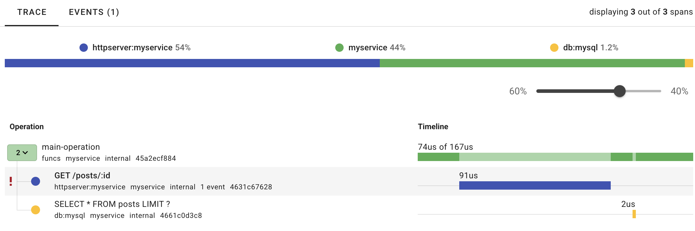

## uptrace

### [Quickstart](https://uptrace.dev/get/opentelemetry-go#quickstart)

Spend 5 minutes to install OpenTelemetry distro, generate your first trace, and click the link in your terminal to view the trace.

* **Step 0**. [Create](https://app.uptrace.dev/join) an Uptrace project to obtain a DSN (connection string), for example, `https://<token>@api.uptrace.dev?grpc=4317`.
* **Step 1**. Install [uptrace-go](https://github.com/uptrace/uptrace-go):

```shell
go get github.com/uptrace/uptrace-go
```

* **Step 2**. Copy the [code](https://github.com/uptrace/uptrace-go/tree/master/example/basic) to `main.go` replacing the DSN:

go

```go
package main

import (
    "context"
    "errors"
    "fmt"

    "go.opentelemetry.io/otel"
    "go.opentelemetry.io/otel/attribute"
    "go.opentelemetry.io/otel/codes"
    "go.opentelemetry.io/otel/trace"

    "github.com/uptrace/uptrace-go/uptrace"
)

func main() {
    ctx := context.Background()

    // Configure OpenTelemetry with sensible defaults.
    uptrace.ConfigureOpentelemetry(
        // copy your project DSN here or use UPTRACE_DSN env var
        // uptrace.WithDSN("<FIXME>"),

        uptrace.WithServiceName("myservice"),
        uptrace.WithServiceVersion("1.0.0"),
    )
    // Send buffered spans and free resources.
    defer uptrace.Shutdown(ctx)

    // Create a tracer. Usually, tracer is a global variable.
    tracer := otel.Tracer("app_or_package_name")

    // Create a root span (a trace) to measure some operation.
    ctx, main := tracer.Start(ctx, "main-operation")
    // End the span when the operation we are measuring is done.
    defer main.End()

    // The passed ctx carries the parent span (main).
    // That is how OpenTelemetry manages span relations.
    _, child1 := tracer.Start(ctx, "GET /posts/:id")
    child1.SetAttributes(
        attribute.String("http.method", "GET"),
        attribute.String("http.route", "/posts/:id"),
        attribute.String("http.url", "http://localhost:8080/posts/123"),
        attribute.Int("http.status_code", 200),
    )
    if err := errors.New("dummy error"); err != nil {
        child1.RecordError(err, trace.WithStackTrace(true))
        child1.SetStatus(codes.Error, err.Error())
        child1.End()
    }

    _, child2 := tracer.Start(ctx, "SELECT")
    child2.SetAttributes(
        attribute.String("db.system", "mysql"),
        attribute.String("db.statement", "SELECT * FROM posts LIMIT 100"),
    )
    child2.End()

    fmt.Printf("trace: %s\n", uptrace.TraceURL(main))
}
```

* **Step 3**. Run the code to get a link for the generated trace:

```shell
go run main.go
trace: https://app.uptrace.dev/traces/<trace_id>
```

* **Step 4**. Follow the link to view the trace

  

### 参考

* https://uptrace.dev/get/opentelemetry-go


## 数据联动

Uptrace 的日志（Logs）、指标（Metrics）和追踪（Traces）三者联动的核心在于它们通过 OpenTelemetry 的统一数据模型（如 trace ID、span ID 等）关联起来，提供一个全面的视角来发现和诊断问题。下面我详细说明它们如何协作，以及如何利用这种联动来排查问题：

---

### 1. **三者联动的机制**

* **追踪（Traces）**：追踪记录了请求在分布式系统中的完整路径（从前端到后端服务）。每个追踪由多个 Span 组成，每个 Span 表示一个操作（如 API 调用、数据库查询）。追踪带有一个唯一的 trace ID。
* **日志（Logs）**：日志是具体的文本记录，通常包含时间戳、上下文信息和详细信息。如果日志通过 OpenTelemetry 收集，它们可以绑定到特定的 trace ID 或 span ID，从而与追踪关联。
* **指标（Metrics）**：指标是聚合的数值数据（如请求延迟、错误率），反映系统整体性能。Uptrace 可以根据追踪数据生成指标，或者直接收集独立的指标数据。

Uptrace 通过 trace ID 或其他上下文标识符，将这三者连接起来。例如，一个慢请求的追踪可以关联到具体的错误日志，而指标则显示这个问题的频率或趋势。

---

### 2. **如何联动发现问题**

以下是一个典型的排查流程，展示三者如何协作：

#### 步骤 1：从指标发现异常

* 你在 Uptrace 的仪表板上看到某个服务的“请求延迟”指标突然飙升（比如 99th 百分位延迟从 200ms 变成 2s），或者错误率从 1% 跳到 10%。
* 指标告诉你“有问题”，但无法告诉你具体原因。这时需要深入到追踪。

#### 步骤 2：通过追踪定位问题来源

* 在 Uptrace 中切换到追踪视图，筛选出延迟高或出错的请求。你会看到完整的请求路径，比如：
  * 前端 → API 服务 → 数据库查询。
* 假设追踪显示数据库查询的 Span 耗时 1.8s，远高于正常值。这告诉你问题可能出在数据库层。
* 追踪提供了具体的时间线和上下文，但还不够详细，需要日志来补充。

#### 步骤 3：结合日志查明细节

* 点击追踪中的某个 Span，Uptrace 会显示关联的日志（如果日志已绑定 trace ID）。比如：
  * 日志显示“Deadlock detected”或“Connection timeout”，表明数据库发生了锁冲突或连接问题。
* 日志提供了具体的错误信息或堆栈跟踪，帮助你理解问题的根本原因。

#### 步骤 4：回到指标验证问题范围

* 你可以用指标确认这个问题是否普遍。例如，查询数据库错误率的指标，看看是单个请求的问题还是整个服务都受影响。
* 如果指标显示问题持续存在，可以进一步优化系统（如增加数据库连接池）。

---

### 3. **实际例子**

假设你运行一个电商网站，用户反馈下单很慢：

* **指标**：你发现“订单处理时间”指标的 P95 延迟从 500ms 涨到 5s。
* **追踪**：查看最近的追踪，发现“支付服务”调用外部 API 的 Span 耗时 4.5s。
* **日志**：关联日志显示“External API timeout, retry failed”，说明外部支付接口超时。
* **解决**：你联系支付服务提供商，或者添加降级逻辑，然后通过指标观察问题是否缓解。

---

### 4. **配置联动的关键**

要让日志、指标和追踪有效联动，需要正确配置：

* **OpenTelemetry SDK**：确保你的应用代码中启用了追踪、指标和日志的采集，并将数据发送到 Uptrace。
* **关联上下文**：日志需要包含 trace ID（通常由 OpenTelemetry 自动注入）。例如，在 Python 中使用 **logging** 时，OpenTelemetry 会自动附加追踪上下文。
* **Uptrace 配置**：确保 Uptrace 的数据源正确接收并存储三类数据，并在仪表板中启用关联查询功能。

---

### 5. **优势与注意事项**

* **优势**：这种三合一的联动让你从宏观（指标）到微观（追踪和日志）逐步缩小问题范围，效率远高于单独分析。
* **注意事项**：如果日志没有正确关联 trace ID，联动会断裂。需要确保开发和运维团队在埋点时保持一致性。
